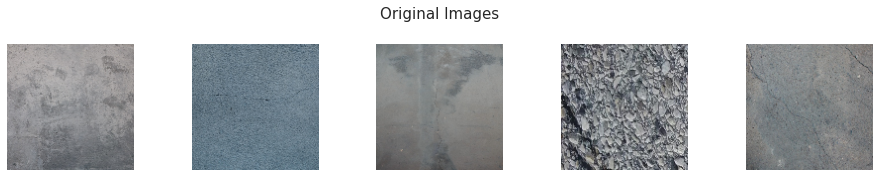
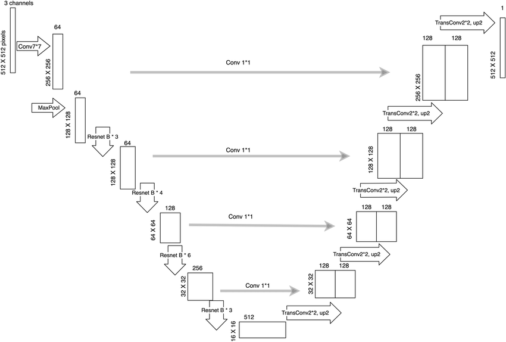
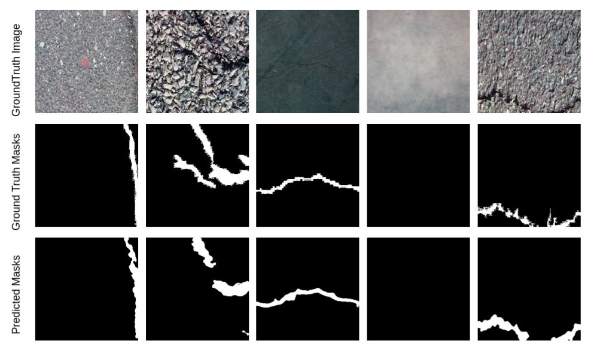

# Cracks Detection
Segmenting cracks over wall images

Crack Detection over walls or any surface is a challenging task as 
1. Cracks in Pixels/image are very few. (need Innovative Training Approach) 
2. This task is expected to be Fast, Light, and Portable. 

This is a perfect project for someone who wants to learn end-to-end ML.(Training== >Deployment). I trained and benchmark a lightweight model that detects cracks in < 40 ms over i5-CPU ( on img dim (128,128) after ML optimization). Here are some images attached.
 
Applications: It can be widely used for object inspection and can be added to Industry Production Pipeline for objects like Chips, bakeries, Bottles, Glass, Pipes, Tiles, Medicines, etc. Unfortunately, most of these jobs are still manual in Industry. It can be easily replaced with EdgeAI and can shift a lot of company's money to inventory and marketing. What you need is a Pi-Camera + Platform hardware +  5 V charger and some time in Coding.

## Dataset:
This crack segmentation dataset contains around 11,200 images which are merged from 12 available crack segmentation dataset. The name prefix of each image is assigned to the corresponding dataset that the image belong to. There're also images which contain no crack, which could be filtered out by the pattern "noncrack*"
All the images in the dataset are resized to the size of (448, 448).

    | -- Train
            | -- images
            | -- masks
    | -- Test
            | -- images
            | -- masks





Ref: [Dataset](https://github.com/khanhha/crack_segmentation/blob/master/README.md)


## Model:
1. Trained Resnet U-net Model of input-dim: (224,224,3)  



Ref: [UNET Model](https://github.com/matterport/Mask_RCNN)

2. Jupyter Notebook, `Kaggle-training.ipyb`: Model Trained and Inference in Kaggle GPU Notebook


## Inference Image



## Requirements
Python 3.7.8, TensorFlow 2.5, and other common packages listed in `requirements.txt`.


## Installation
1. Clone this repository
2. Install dependencies
   ``` pip3 install -r requirements.txt ```
3. Run setup from the repository root directory
    ``` python3 setup.py install ``` 

